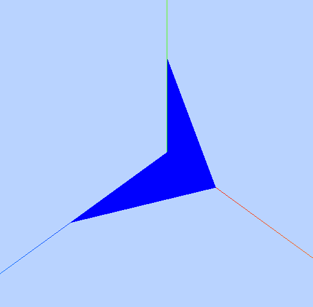
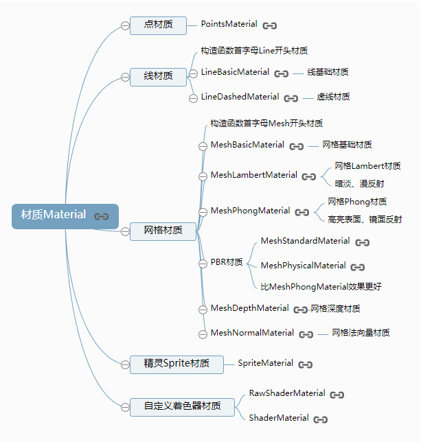
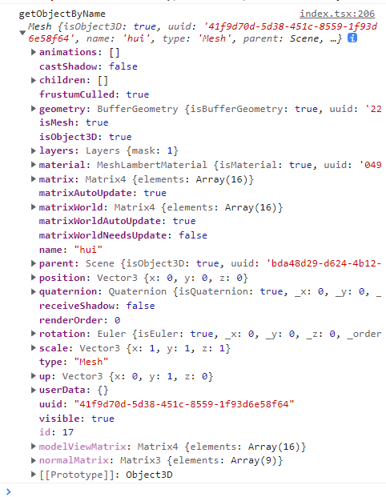

- [简介](md_doc/intro.md)
- [顶点和几何体结构](md_doc/顶点和几何体结构.md)
- [材质](md_doc/material.md)

<table>
  <thead>
      <th>属性</th>
      <th>描述</th>
  </thead>
  <tbody>
    <tr>
      <td>color</td>
      <td>LineCap</td>
    </tr>
    <tr>
      <td>linewidth</td>
      <td>LineCap</td>
    </tr>
     <tr>
      <td>LineCap</td>
      <td>LineCap</td>
    </tr>
    <tr>
      <td>wireframe</td>
      <td>LineCap</td>
    </tr>
  </tbody>
</table>

# 辅助坐标系



```
var axesHelper = new THREE.AxesHelper(250);
scene.add(axesHelper);
```

# BufferGeometry 总结


## API 使用总结

```
BufferGeometry: 顶点位置、颜色、法向量、索引数据

// 访问几何体顶点位置数据
BufferGeometry.attributes.position
// 访问几何体顶点颜色数据
BufferGeometry.attributes.color
// 访问几何体顶点法向量数据
BufferGeometry.attributes.normal
```

- Threejs 渲染的时候会先把 Geometry 转化为 BufferGeometry 再解析几何体顶点数据进行渲染

# Material 材质



# 常用方法

```
// 场景全部对象
scene.children

// 通过场景名称获取对象，需要对场景对象添加名称
mesh.name = "hui";
...
scene.getObjectByName("hui",false)
- true：所有子集中查找
- false: 只在当前层查找

// 删除对象
removeFindCube = () => {
  const findObj = scene.getObjectByName("hui", false);
  if (findObj instanceof THREE.Mesh) {
    scene.remove(findObj);
    console.log("getObjectByName", scene.getObjectByName("hui", false));
  }
};

// 开启阴影
mesh.castShadow = true
```

- import \* as dat from "lil-gui";

```
const ctrlObj = {
  removeFindCube: () => this.removeFindCube(),
};

let ctrl = new dat.GUI();
ctrl.add(ctrlObj, "removeFindCube");
```

# controls

```
import { OrbitControls } from "three/examples/jsm/controls/OrbitControls.js";

controls = new OrbitControls(camera, renderer.domElement);
controls.enableDamping = true; // 阻尼将通过添加某种加速度和摩擦公式来平滑动画
```

配合 animation

```
animation = () => {
  renderer.render(scene, camera); //执行渲染操作
  requestAnimationFrame(this.animation.bind(this));
};
```



> 废弃 API
> http://jsrun.net/t/g3pKp

> Face3 已经在 R125 之后移除 THREE 的核心类(Geometry 也是被移除，替换它的是 BufferGeometry)，可以通过模块导入方法来引用, 具体版本未知
> import { Face3, Geometry } from 'three/examples/jsm/deprecated/Geometry';

> THREE.Geometry() -> THREE.BufferGeometry()
> THREE.Face3()
