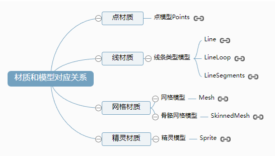
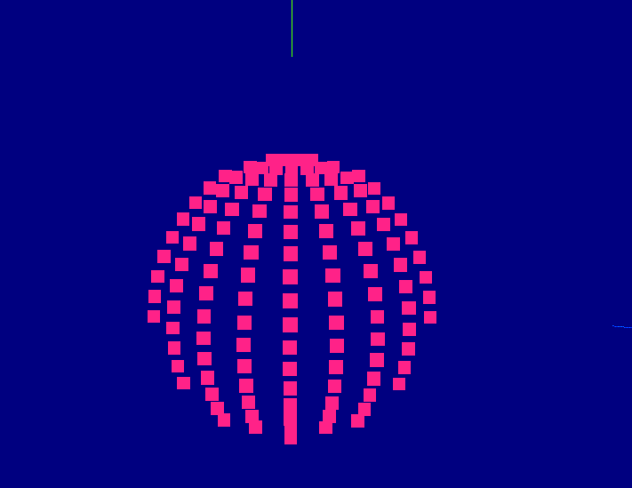
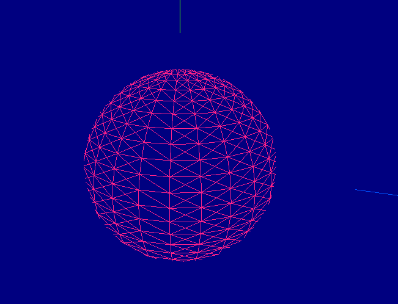
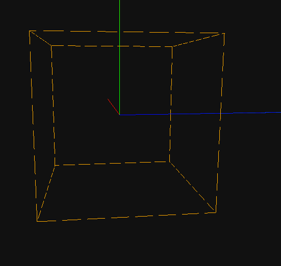

# Material 材质

- 材质
  

- 材质和模型对象对应关系
  

## 点材质 PointsMaterial

只有 PointsMaterial,通常使用点模型的时候会使用点材质 PointsMaterial


**Points** 用于显示点的类

```
/**
   * 创建点模型
   * PointsMaterial 点材质
   * SphereGeometry 球体几何对象
   * Points 用于显示点的类
   */
  usePointsMaterial = () => {
    const _geometry = new THREE.SphereGeometry(30, 25, 25);
    const material = new THREE.PointsMaterial({
      color: 0xff2288,
      size: 3, //点渲染尺寸
    });

    let point_cube = new THREE.Points(_geometry, material); // 网格模型对象Mesh
    scene.add(point_cube); // 网格模型添加到场景中
  };
```

## 线材质

通常使用使用 Line 等线模型才会用到线材质。

- 基础线材质 LineBasicMaterial
  

  ```
  /**
   * 创建等线模型
   * 基础线材质: LineBasicMaterial
   * Line等线模型: Line
   */
  useLineBasicMaterial = () => {
    const _geometry = new THREE.SphereGeometry(30, 25, 25);
    const _material = new LineBasicMaterial({
      color: 0xff2288,
    });
    const line_cube = new THREE.Line(_geometry, _material);
    scene.add(line_cube);
  };
  ```

- 虚线材质 LineDashedMaterial
  

```
/**
  * 创建Line等线模型
  * 虚线材质: LineBasicMaterial
  * Line等线模型: Line
  * computeLineDistances： 计算LineDashedMaterial所需的距离数组
  *
  * this.box: https://github.com/mrdoob/three.js/blob/master/examples/webgl_lines_dashed.html
  */
useLineDashedMaterial = () => {
  // const _geometry = new THREE.SphereGeometry(60, 10, 10);
  const _geometry = this.box(50, 50, 50);
  const _material = new THREE.LineDashedMaterial({
    color: 0xffaa00,
    dashSize: 3, //显示线段的大小。默认为3。
    gapSize: 1, //间隙的大小。默认为1
  });
  const line_cube = new THREE.LineSegments(_geometry, _material);
  line_cube.computeLineDistances();

  console.log("computeLineDistances方法", line_cube.computeLineDistances());
  scene.add(line_cube);
};
```

## 网格模型

### 基础网格材质对象 MeshBasicMaterial

### MeshLambertMaterial 材质

- 可以实现网格 Mesh 表面与光源的漫反射光照计算
- 有了光照计算，物体表面分界的位置才会产生棱角感。

### 高光网格材质 MeshPhongMaterial

该材质可以模拟具有镜面高光的光泽表面（例如涂漆木材）
