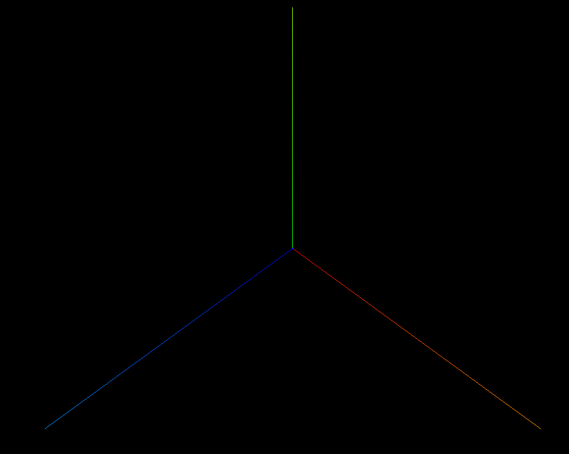
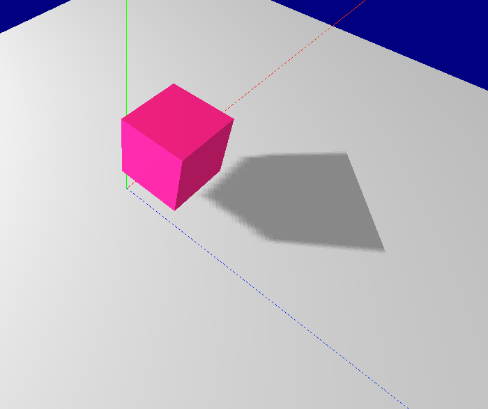

# 动力实训学习

# base

```
addGeometry = () => {
  geometry = new THREE.BoxGeometry(30, 30, 30);
  const material = new THREE.MeshBasicMaterial({
    color: 0xff2288,
  });

  let cube = new THREE.Mesh(geometry, material); //网格模型对象Mesh
  cube.name = "hui";
  // x轴右移 4个单位
  cube.position.x = 4;
  // y轴上移
  cube.position.y = 10;
  // z轴前移
  cube.position.z = 5;

  scene.add(cube); //网格模型添加到场景中
  console.log("getObjectByName", scene.getObjectByName("hui", false));
};
```

# 辅助线 AxesHelper

用于简单模拟 3 个坐标轴的对象.


```
const axes = new AxesHelper(50); // 50 长度
// 设置 x,y,z轴不同颜色
axes.setColors(0xf0f8ff, 0xfaebd7, 0x00ffff);
scene.add(axes);
```

# 材质

## MeshBasicMaterial 基础材质

## MeshLambertMaterial 可以接收各种光源

- 如没有效果注意 geometry 材质改成 MeshLambertMaterial
- 光源+阴影

```

// 点光源
const spotLight = new THREE.SpotLight(0xffffff);
// 设置位置
spotLight.position.set(-60, 40, -65);
// 启用阴影
spotLight.castShadow = true;
spotLight.shadow.mapSize = new Vector2(1024, 1024);
spotLight.shadow.camera.far = 130;
spotLight.shadow.camera.near = 40;
scene.add(spotLight);

// 启用阴影
renderer.shadowMap.enabled = true;

// 地面接收阴影对象
p_cube.receiveShadow = true

// 立方体 阴影
cube.castShadow = true;
```


