# 顶点位置数据解析渲染(2_demo)

## 自定义几何体

- BufferGeometry
- BufferAttribute
- 自定义一个具有六个顶点数据的几何体

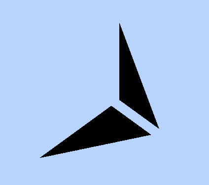

```
var geometry = new THREE.BufferGeometry(); //创建一个Buffer类型几何体对象
//类型数组创建顶点数据
var vertices = new Float32Array([
  0, 0, 0, //顶点1坐标
  50, 0, 0, //顶点2坐标
  0, 100, 0, //顶点3坐标
  0, 0, 10, //顶点4坐标
  0, 0, 100, //顶点5坐标
  50, 0, 10, //顶点6坐标
]);
// 创建属性缓冲区对象
var attribue = new THREE.BufferAttribute(vertices, 3); //3个为一组，表示一个顶点的xyz坐标
// 设置几何体attributes属性的位置属性
geometry.attributes.position = attribue;
```

- 通过自定义的几何体创建一个网格模型。
- 对于网格模型而言，几何体所有顶点每三个顶点为一组可以确定一个三角形，几何体是六个顶点，也就是说可以绘制两个三角形

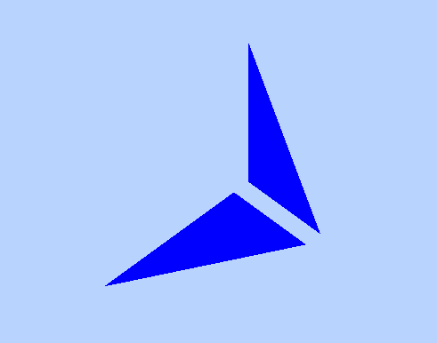

```
// 三角面(网格)渲染模式
var material = new THREE.MeshBasicMaterial({
  color: 0x0000ff, // 三角面颜色
  side: THREE.DoubleSide // 两面可见
});
var mesh = new THREE.Mesh(geometry, material); //网格模型对象Mesh
```

## 点模型 Points


```
// 点渲染模式
var material = new THREE.PointsMaterial({
  color: 0xff0000,
  size: 10.0 //点对象像素尺寸
}); //材质对象
var points = new THREE.Points(geometry, material); //点模型对象
scene.add(points); //点对象添加到场景中
```

## 线模型 Line


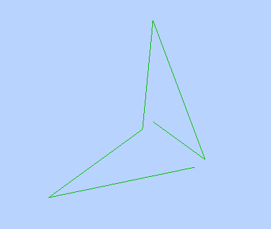

```
// 线条渲染模式
var material=new THREE.LineBasicMaterial({
    color:0xff0000 //线条颜色
});//材质对象
var line=new THREE.Line(geometry,material);//线条模型对象
scene.add(line);//线条对象添加到场景中
```

- LineBasicMaterial 材质是用来渲染线段的材质，可以通过该材质来设置线段的颜色、宽度、端点和连接点
<table>
  <thead>
      <th>属性</th>
      <th>描述</th>
  </thead>
  <tbody>
    <tr>
      <td>color</td>
      <td>线的颜色，如果指定了vertexColor，该属性会被忽略</td>
    </tr>
    <tr>
      <td>linewidth</td>
      <td>线的宽度</td>
    </tr>
     <tr>
      <td>LineCap</td>
      <td>
        <div>顶点间的线段端点如何显示<div>
        <div><strong>可选的值</strong>包括：butt（平）、round（圆）、square（方）。默认值是 round。<div>
        <div>WebGLRender不支持该属性<div>
      </td>
    </tr>
    <tr>
      <td>LineJoin</td>
      <td>
        <div>线段连接点如何显示<div>
        <div><strong>可选的值</strong>包括：round（圆）、bevel（斜切）、miter（尖角）。默认值是 round<div>
        <div>WebGLRender不支持该属性<div>
      </td>
    </tr>
    <tr>
      <td>vertexColors</td>
      <td>如果将这个属性设定为 THREE.VertexColors 值时，就可以为每一个顶点指定一种颜色</td>
    </tr>
    <tr>
      <td>fog</td>
      <td>此属性指定当前物体是否受全局雾化效果的影响</td>
    </tr>
  </tbody>
</table>

### linewidth 不生效

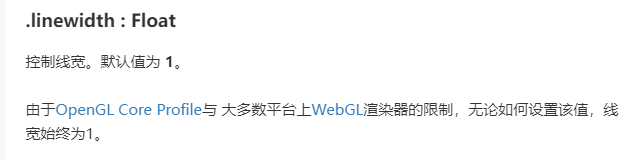

- https://www.jianshu.com/p/f5935f8482ba

- 此方法可以设置宽度
  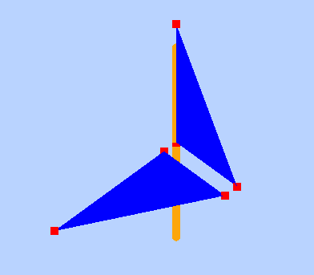

```
import { Line2 } from 'three/examples/jsm/lines/Line2'
import { LineGeometry } from 'three/examples/jsm/lines/LineGeometry'
import { LineMaterial } from 'three/examples/jsm/lines/LineMaterial'

<!-- 关键点：Line2, LineGeometry，LineMaterial  -->
// 可以设置线条宽度
const _geometry4 = new LineGeometry();
var pointArr = [0, 80, 0, 0, -80, 0];
_geometry4.setPositions(pointArr);
const _material4 = new LineMaterial({
  color: 0xfca60b,
  linewidth: 10,
});
_material4.resolution.set(window.innerWidth, window.innerHeight);
const _line4 = new Line2(_geometry4, _material4);
_line4.computeLineDistances();
scene.add(_line4); //线条对象添加到场景中
```

## 几何体本质

- 查看下面一段代码，你可以看出来立方体网格模型 Mesh 是由立方体几何体 geometry 和材质 material 两部分构成，立方体几何体 BoxGeometry 本质上就是一系列的顶点构成，只是 Threejs 的 APIBoxGeometry 把顶点的生成细节封装了，用户可以直接使用。比如一个立方体网格模型，有 6 个面，每个面至少两个三角形拼成一个矩形平面，每个三角形三个顶点构成，对于球体网格模型而言，同样是通过三角形拼出来一个球面，三角形数量越多，网格模型表面越接近于球形。

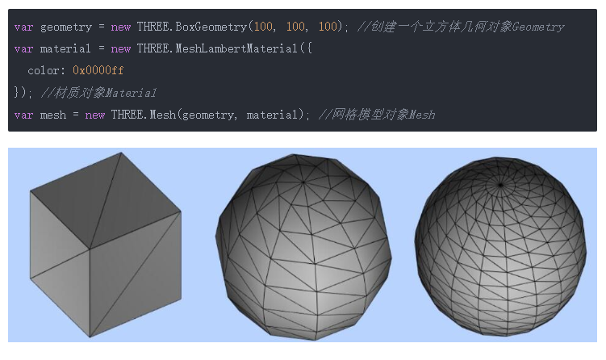

# 顶点颜色数据插值计算(几何体顶点颜色)

- 通常几何体顶点位置坐标数据和几何体顶点颜色数据都是一一对应的，比如顶点 1 有一个顶点位置坐标数据，也有一个顶点颜色数据，顶点 2 同样也有一个顶点位置坐标数据，也有一个顶点颜色数据...

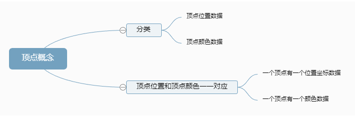

## 每个顶点设置一种颜色

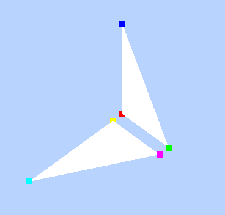

```
// 1_1. 每个顶点设置一种颜色
addPointClolr = () => {
  // 类型数组创建顶点颜色color数据
  var colors = new Float32Array([
  1, 0, 0, //顶点1颜色
  0, 1, 0, //顶点2颜色
  0, 0, 1, //顶点3颜色

  1, 1, 0, //顶点4颜色
  0, 1, 1, //顶点5颜色
  1, 0, 1, //顶点6颜色
]);

  // 设置几何体attributes属性的颜色color属性
  geometry.attributes.color = new THREE.BufferAttribute(colors, 3); //3个为一组,表示一个顶点的颜色数据RGB

  const _material2 = new THREE.PointsMaterial({
    // color: 0xff0000,
    vertexColors: true, // 以顶点颜色为准
    size: 10.0, //点对象像素尺寸
  }); //材质对象
  var points = new THREE.Points(geometry, _material2); //点模型对象
  scene.add(points); //点对象添加到场景中
};
```

- THREE 上不存在属性“VertexColors”
  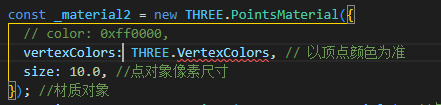
  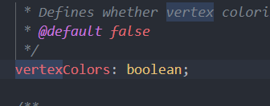
  vertexColors: true

## 属性缓冲区对象 BufferAttribute

- Threejs 提供的接口 BufferAttribute 目的是为了创建各种各样顶点数据，比如顶点颜色数据，顶点位置数据
- `顶点位置数据`: BufferGeometry.attributes.position
- `顶点颜色属性`: BufferGeometry.attributes.color

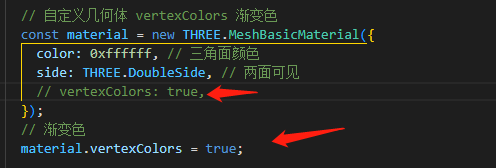
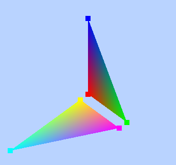

# 顶点法向量数据光照计算

## 定义几何体顶点法向量数据

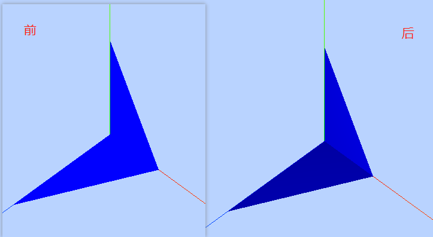

- 顶点法向量光照计算
  在上面顶点位置数据基础上定义顶点法向量数据，这时候除了环境光以外，点光源也会参与光照计算，三角形整个表面比较明亮，同时两个三角形表面法线不同，即使光线方向相同，明暗自然不同，在分界位置有棱角感。

- 前

  ```
  const material = new THREE.MeshBasicMaterial({
    color: 0x0000ff, // 三角面颜色 0x0000ff 0x000144
    side: THREE.DoubleSide, // 两面可见
  });
  ```

- 后

  ```
  const _normals = new Float32Array([
    0, 0, 1, //顶点1法向量
    0, 0, 1, //顶点2法向量
    0, 0, 1, //顶点3法向量

    0, 1, 0, //顶点4法向量
    0, 1, 0, //顶点5法向量
    0, 1, 0, //顶点6法向量
  ]);
  // 设置几何体attributes属性的位置normal属性
  // 3个为一组,表示一个顶点的法向量数据
  geometry.attributes.normal = new THREE.BufferAttribute(_normals, 3);
  const material = new THREE.MeshLambertMaterial({
    color: 0x0000ff, // 三角面颜色
    side: THREE.DoubleSide, // 两面可见
  });

  ```

## API 使用总结

```
// 访问几何体顶点位置数据
BufferGeometry.attributes.position
// 访问几何体顶点颜色数据
BufferGeometry.attributes.color
// 访问几何体顶点法向量数据
BufferGeometry.attributes.normal
```

# 顶点索引复用顶点数据

通过几何体 BufferGeometry 的顶点索引属性 BufferGeometry.index 可以设置几何体顶点索引数据，如果你有 WebGL 基础很容易理解顶点索引的概念，如果没有也没有关系，下面会通过一个简单的例子形象说明。

比如绘制一个矩形网格模型,至少需要两个三角形拼接而成，两个三角形，每个三角形有三个顶点，也就是说需要定义 6 个顶点位置数据。对于矩形网格模型而言，两个三角形有两个顶点位置是重合的。也就是说可以重复的位置可以定义一次，然后通过通过顶点数组的索引值获取这些顶点位置数据

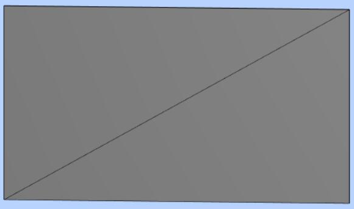

## 顶点索引.index

- 不使用顶点索引 or 顶点索引.index
  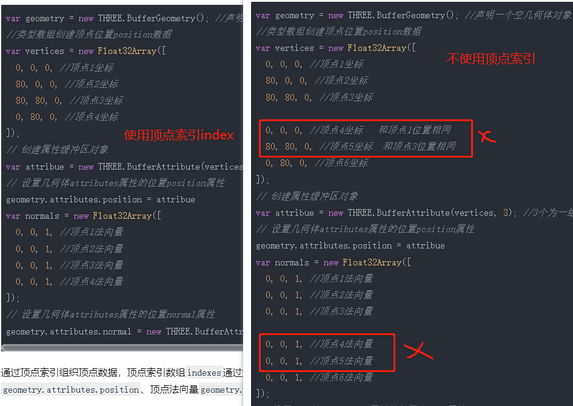
  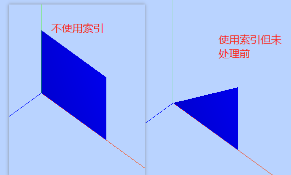

- 顶点索引.index

  通过顶点索引组织顶点数据，顶点索引数组 indexes 通过索引值指向顶点位置 geometry.attributes.position、顶点法向量 geometry.attributes.normal 中顶面数组。
  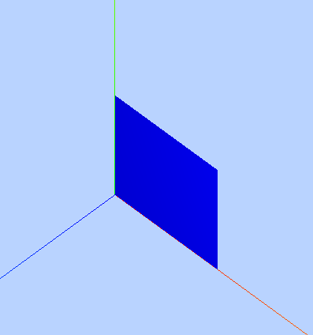

  ```
  // ！重点：Uint16Array类型数组创建顶点索引数据
  const indexes = new Uint16Array([
    // 0对应第1个顶点位置数据、第1个顶点法向量数据
    // 1对应第2个顶点位置数据、第2个顶点法向量数据
    // 索引值3个为一组，表示一个三角形的3个顶点
    0, 1, 2, 0, 2, 3,
  ]);
  // 索引数据赋值给几何体的index属性
  geometry.index = new THREE.BufferAttribute(indexes, 1); //1个为一组
  ```

  创建顶点索引数组的时候，可以根据顶点的数量选择类型数组 Uint8Array、Uint16Array、Uint32Array。对于顶点索引而言选择整型类型数组，对于非索引的顶点数据，需要使用浮点类型数组 Float32Array 等。
  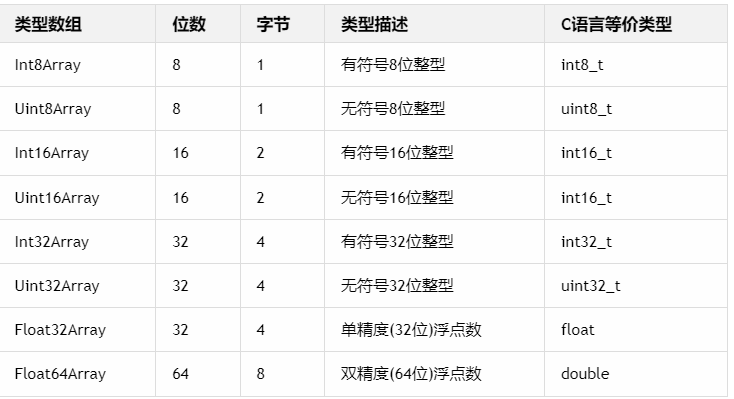

## BufferGeometry 总结

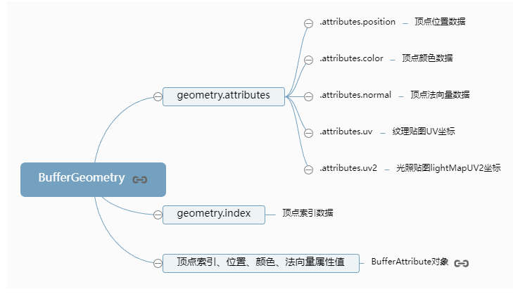

---

# 设置 Geometry 顶点位置、顶点颜色数据

## 几何体 APIGeometry

# Face3 对象定义 Geometry 的三角形面

# 访问几何体对象的数据

# 几何体旋转、缩放、平移变换
